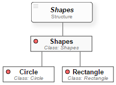

# Anisha
The **Anisha** is to build two XML-based DSLs for animating basic shapes using [PsiXML Interpreter and PsiEngine](http://hilas.ii.uam.es/api). 
The case of study will be used as an illustrative example, which details the interpretation and execution 
processes of multiple programs as well as the information binding in [PsiEngine](http://hilas.ii.uam.es).

## Goal

The goal of *Anisha* is to build two DSLs for animating basic shapes. The *Anisha* case study has had as main objective to illustrate some 
**PsiXML Interpreter** features, called *PsiXML*. Firstly, this case study allows us to validate the heterogeneous source information 
(XML and JSON) binding. This feature gives versatility to the XML-based languages in *PsiXML*. Secondly, Anisha let us test the coexistence 
of multiple Psi languages as well as the feature of runing multiple Psi programs with ease information exchange and functionality sharing. 
In general, *PsiXML* allow creating XML-based DSL with a high level of abstraction, easy to understand, extendable and combinable.

## Shapes Component

### ShapesPsi Grammar
The ShapesPsi Language is a DSL that follows an XML-based grammar for creating circles and rectangles. The Figure 1 shows the *Psi Language Structure Diagram* 
(**PsiLSD**) of the ShapesPsi Language.<br>

<br>
**Figure 1**. PsiLSD of the ShapesPsi Language. <br>
In Figure 1, we can summarize that the root tag **Shapes** is the beginning of the program. Then, we can define:<br>
1. **Circle** tag (opcional, multiple): creating circles based on SVG. *Attributes*: id (identifier), center (x,y), radius (default=10), style(CSS) 
2. **Rectangle** (opcional, multiple): creating rectangles based on SVG. *Attributes*: id (identifier, center (x,y), width (default=10), height (default=10), style(CSS)

## Running the examples

The next XML file program shows a code example written in **ShapesPsi** language. In this code we can see how to create a red circle with centre at point (100, 100), 
**Circle** tag, radius 30 (all units in pixels), and a blue rectangle with centre at point (250, 100), **Rectangle** tag, weight 20 and high 10. Evaluation can 
be seen here.
```xml
<?xml version="1.0" encoding="utf-8"?><Shapes name="Basic example ShapesPsi">
  <Circle id="c1" center="100,100" radius="30" label="Circle" style="fill:red;stroke:gray;stroke-width:2px"/>
  <Rectangle id="r1" center="250,100" width="70" height="50" label="Rectangle" style="fill:blue;stroke:gray;stroke-width:2px"/>
</Shapes>
```