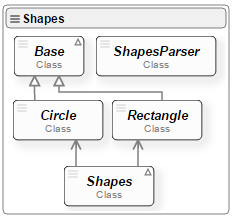
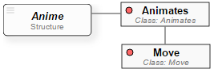
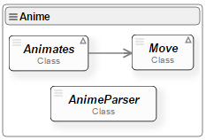

# Anisha
The **Anisha** is to build two XML-based DSLs for animating basic shapes using [PsiXML Interpreter and PsiEngine](http://hilas.ii.uam.es/api). 
The case of study will be used as an illustrative example, which details the interpretation and execution 
processes of multiple programs as well as the information binding in [PsiEngine](http://hilas.ii.uam.es).

## 1. Goal

The goal of *Anisha* is to build two DSLs for animating basic shapes. The *Anisha* case study has had as main objective to illustrate some 
**PsiXML Interpreter** features, called *PsiXML*. Firstly, this case study allows us to validate the heterogeneous source information 
(XML and JSON) binding. This feature gives versatility to the XML-based languages in *PsiXML*. Secondly, Anisha let us test the coexistence 
of multiple Psi languages as well as the feature of runing multiple Psi programs with ease information exchange and functionality sharing. 
In general, *PsiXML* allow creating XML-based DSL with a high level of abstraction, easy to understand, extendable and combinable.

## 2. Shapes Component

### 2.1. ShapesPsi Grammar
The **ShapesPsi Language** is a DSL that follows an XML-based grammar for creating circles and rectangles. The Figure 1 shows the [Psi Language Structure Diagram](http://hilas.ii.uam.es/api) 
(**PsiLSD**) of the ShapesPsi Language.<br>

<br>
**Figure 1**. PsiLSD of the ShapesPsi Language.

In Figure 1, we can summarize that the root tag **Shapes** is the beginning of the program. Then, we can define:<br>

-  **Circle** tag (opcional, multiple): creating circles based on SVG. *Attributes*: id (identifier), center (x,y), radius (default=10), style(CSS) 
-  **Rectangle** (opcional, multiple): creating rectangles based on SVG. *Attributes*: id (identifier, center (x,y), width (default=10), height (default=10), style(CSS)

### 2.2. Classes diagram
The class diagram for **Shapes Component** is shown in Figure 2. The *Shapes* class defines the set of circles and rectangles. The *Base* abstract class defines a 
generic figure, while the *Circle* class paints a circle with a text in the middle on a SVG canvas, and the *Rectangle* class paints a rectangle with a text in 
the middle. All the circles and rectangles coded are stored in **Psi Data** (PsiEngine) so that they can be used by other programs and languages.

<br>
**Figure 2**. Class diagram for the Shapes Component.

## 3. Anime Component

### 3.1. AnimePsi Grammar
The **AnimePsi Language** is a DSL that follows an XML-based grammar for moving figures defined with **ShapesPsi**. The Figure 3 shows the [PsiLSD](http://hilas.ii.uam.es/api) of the 
AnimePsi Language.<br>

<br>
**Figure 3**. PsiLSD of the AnimePsi Language.

According to Figure 3, the **Animates** root tag specifies a set of figures movements, i.e. multiple **Move** tags. The **Move** tag defines a reference to the figure 
(key attribute), a path for the movement (path attribute), the number of steps in the path (steps attribute), the number of seconds for movement (seconds attribute), 
the initial waiting time (wait attribute, default 0) and if the movement must be repeated (repeat attribute, default "no").

### 3.2. Classes diagram
The **Anime Component** implements the functionality related to the AnimePsi language, as shown in the class diagram of Figure 4. This component has two classes: 
*Animates* and *Move*, binded to the **Animates** and **Move** tags respectively. The *Animates* class starts the animation program, while the *Move* class implements 
the movement binded to **Move** tag and based on the definition of the SVG path tag.

<br>
**Figure 3**. Class diagram for the Anime Component.

## 4. Running the examples

The next XML file program shows a code example written in **ShapesPsi** language. In this code we can see how to create a red circle with centre at point (100, 100), 
**Circle** tag, radius 30 (all units in pixels), and a blue rectangle with centre at point (250, 100), **Rectangle** tag, weight 20 and high 10. Evaluation can 
be seen [here](http://hilas.ii.uam.es/anisha/basic).
```xml
<?xml version="1.0" encoding="utf-8"?>
<Shapes name="Basic example ShapesPsi">
  <Circle id="c1" center="100,100" radius="30" label="Circle" style="fill:red;stroke:gray;stroke-width:2px"/>
  <Rectangle id="r1" center="250,100" width="70" height="50" label="Rectangle" 
             style="fill:blue;stroke:gray;stroke-width:2px"/>
</Shapes>
```
In next XML file program we can see the characters motion defined in the previous fragment. In evaluating this AnimePsi program, "Luke" approaches to "Obi-Wan" and this 
last one runs off. Evaluation can be seen [here](http://hilas.ii.uam.es/anisha/runs).
```xml
<?xml version="1.0" encoding="utf-8"?>
<Animates name="runs, Obi-Wan, runs">
  <Move key="cp1" steps="50" seconds="3" path="L100,50L180,200"/>
  <Move key="cp2" steps="50" seconds="5" wait="4"
        path="C250,100 400,100 400,200 S550,300 550,200 C550,50 100,50 100,200 L100,300 L250,300 l250,200"/>
</Animates>
```

## 5. Installation
Create a website and copy all files. The file summarizes "api.html" the case study. The file "execute.html" all running examples available.